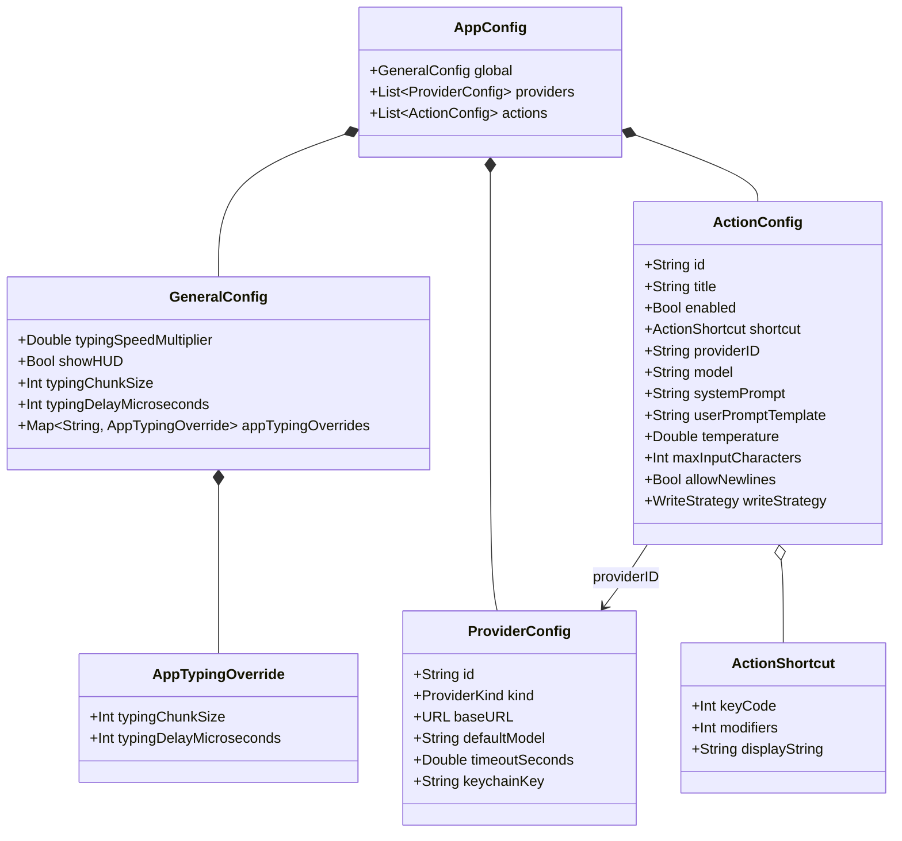
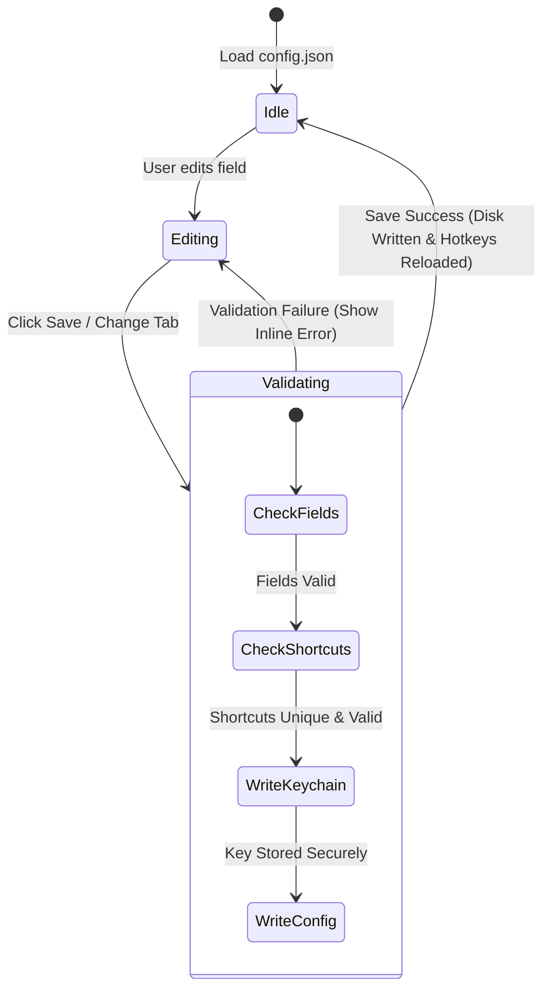

# Data Model: GUI Configuration Settings

This document describes the logical data structures and validation constraints used by the GUI settings interface.

## Configuration Entities

The underlying data structures are defined in [AppConfig.swift](file:///Users/Stanislav_Deviatov/src/github/overtype/Sources/Overtype/Config/AppConfig.swift). The GUI settings interface will load, edit, and persist these models.

## Validation Rules

### 1. Identifiers (`id`)
- **Generation**: Auto-generated by converting the Name (for providers) or Title (for actions) into a lowercase slug:
  - Trim whitespace.
  - Convert characters to lowercase.
  - Replace spaces and non-alphanumeric characters with a single hyphen (`-`).
  - Strip leading/trailing hyphens.
- **Uniqueness**: Must be unique within the respective list (providers or actions). If a conflict is detected, append a sequential numeric suffix (e.g. `openai-1`, `fix-grammar-2`).
- **Mutability**: Once created, the `id` is read-only and cannot be changed, ensuring that existing action-to-provider mappings remain unbroken.

### 2. Actions & Shortcuts
- **Shortcut Uniqueness**: No two enabled actions can be registered with the same `keyCode` and `modifiers` combination.
- **Shortcut Validity**: A recorded shortcut must include at least one modifier key (Command, Option, Control, or Shift) to prevent trapping normal alpha-numeric keys.
- **Prompts**:
  - `systemPrompt` must not be empty.
  - `userPromptTemplate` must contain the string replacement placeholder `{{text}}`.
- **Temperature**: Must be a double value between `0.0` and `2.0` (inclusive).

### 3. Providers & Secrets
- **baseURL**: Must be a well-formed absolute URL.
- **timeoutSeconds**: Must be a positive number between `1.0` and `300.0`.
- **API Key**: 
  - Must be entered when creating/editing a provider.
  - Must be saved securely via `KeychainStore.shared` under the generated `keychainKey` name.
  - Must not be written to `config.json`.
  - The `keychainKey` value itself is auto-generated as `overtype-[provider-id]-key` and saved in `config.json`.

## State Transitions

